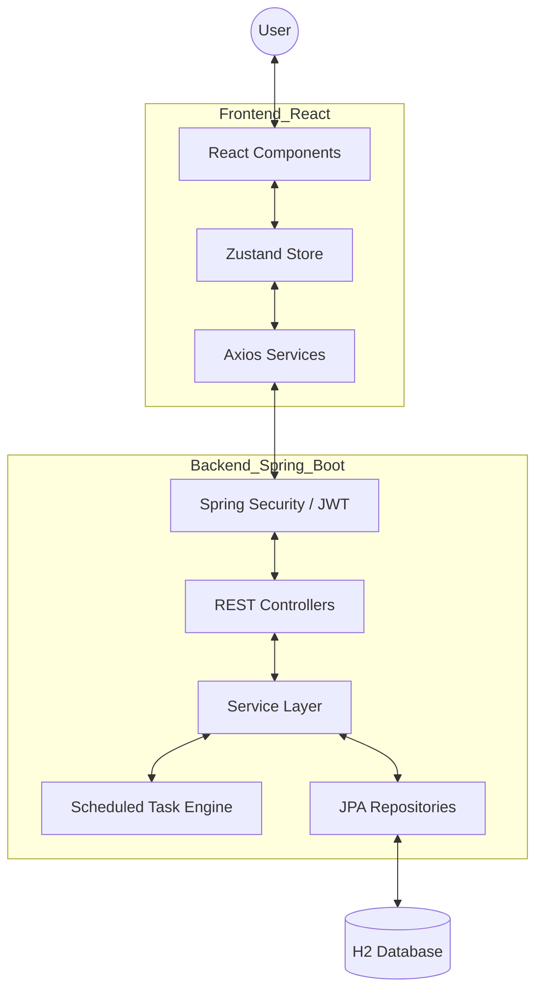
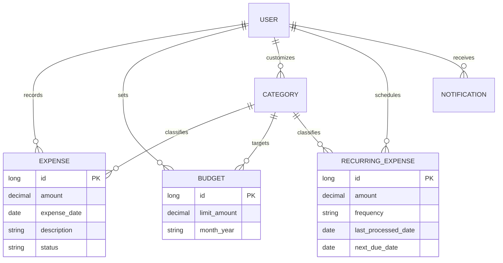

# PROJECT REPORT: Smart Personal Finance & Expense Tracker with AI Insights

**Developed by:** [Your Name/Team]  
**Academic Session:** 2025-2026  
**Technology Stack:** Java Spring Boot, React, H2 Database, JWT Security, AI/ML Analytics  

---

## 1. ABSTRACT
In the modern era of digital transactions, managing personal finances has become increasingly complex. The "Smart Personal Finance & Expense Tracker" is a full-stack web application designed to simplify wealth management through automation and intelligent insights. Unlike traditional tracking apps, this system integrates **Automated Recurring Cycles**, **AI-Driven Health Scoring**, and **Predictive Budgeting**. 

The backend is powered by **Java Spring Boot**, ensuring a robust, scalable architecture with high-performance database management using **H2/JPA**. The frontend is a highly responsive **React** application built with a focus on premium aesthetics, featuring a sophisticated **Dark Mode** and dynamic data visualizations. Security is handled via **JWT (JSON Web Tokens)**, ensuring that user data remains private and encrypted.

---

## 2. INTRODUCTION
### 2.1 Overview
Personal financial literacy is a cornerstone of individual success. However, manual tracking of every expense is tedious and prone to error. This project aims to bridge the gap between manual entry and full financial awareness. 

### 2.2 Purpose
The purpose of this application is to provide users with a unified dashboard to:
1.  Track daily income and expenditures.
2.  Automate fixed monthly costs (Rent, Subscriptions, Gym).
3.  Set and monitor category-based budgets.
4.  Receive AI-generated suggestions to improve financial health.

### 2.3 Scope
The scope includes a full-stack implementation covering user authentication, CRUD operations for financial records, scheduling engines for recurring tasks, and a data-driven analytics engine.

---

## 3. PROBLEM STATEMENT & OBJECTIVES
### 3.1 Problem Statement
Most existing finance trackers suffer from three main issues:
*   **Duplicate Entries**: Lack of tracking for recurring items leading to manual double-entry.
*   **Poor Visibility**: Users cannot see their "projected" spending until it actually happens.
*   **Static Data**: Traditional apps show what happened in the past but don't explain how to improve the future.

### 3.2 Objectives
The primary objectives of this project are:
*   **Automation**: Implement a "Process Once" logic for recurring expenses to prevent duplicates.
*   **Synchronization**: Automatically link recurring costs to budget projections.
*   **Aesthetics**: Provide a "State-of-the-Art" Dark Mode UI that feels like a premium banking app.
*   **Insights**: Use algorithmic health scoring to give users a grade (A-F) on their spending habits.

---

## 4. TECHNOLOGY STACK
### 4.1 Backend (Server-Side)
*   **Language**: Java 21
*   **Framework**: Spring Boot 3.2.x
*   **Data Access**: Spring Data JPA (Hibernate)
*   **Security**: Spring Security 6, JWT (io.jsonwebtoken)
*   **Database**: H2 (In-memory/File-based for development)
*   **Build Tool**: Maven

### 4.2 Frontend (Client-Side)
*   **Library**: React 18
*   **Styling**: Vanilla CSS3 (Custom Design System)
*   **State Management**: Zustand / React Context
*   **Icons**: FontAwesome / Lucide React
*   **Charts**: Chart.js / Recharts

### 4.3 Tools & DevOps
*   **IDE**: IntelliJ IDEA / VS Code
*   **Version Control**: Git
*   **Testing**: JUnit 5, Mockito

---

## 5. SYSTEM ARCHITECTURE
### 5.1 High-Level Architecture (MVC Pattern)
The system follows a standard **Model-View-Controller (MVC)** pattern but is adapted for a decoupled RESTful architecture.



---

## 6. DATABASE DESIGN
The database is designed with 3rd Normal Form (3NF) principles to ensure data integrity and avoid redundancy.

### 6.1 Entity Relationship Diagram (ERD)


---

## 7. KEY MODULES & FEATURES
### 7.1 Recurring Expense Automation (The "Smart Engine")
This module is the core of the project's automation. It uses a custom logic to prevent the "Double Entry" problem requested by users.
*   **Logic**: A `@Scheduled` task runs every midnight.
*   **Tracking**: Uses a `lastProcessedDate` field to ensure that if a user manually triggers "Process Now", the system remembers and won't auto-process it again until the next month.

### 7.2 Budget Projection Sync
Every active recurring expense is automatically summed and displayed as "Projected Spending" in the category budget. This allows users to see their committed costs before they occur.

### 7.3 AI Health Score Logic
The system calculates a score from 0-100 based on:
*   Budget adherence (Spending vs. Limit).
*   Spending volatility (Standard deviation of daily costs).
*   Essential vs. Discretionary ratio.

---

## 8. API DOCUMENTATION
The system exposes a secured REST API for all financial operations. All endpoints (except Login/Register) require a `Bearer <JWT_TOKEN>` in the Authorization header.

### 8.1 Authentication Endpoints
| Method | Endpoint | Description |
|---|---|---|
| POST | `/api/auth/register` | Create a new user account |
| POST | `/api/auth/login` | Authenticate and receive JWT |

### 8.2 Expense Management
| Method | Endpoint | Description |
|---|---|---|
| GET | `/api/expenses` | Retrieve all user expenses |
| POST | `/api/expenses` | Log a new expense |
| DELETE | `/api/expenses/{id}` | Remove an expense entry |

### 8.3 Recurring Expense Engine
| Method | Endpoint | Description |
|---|---|---|
| PATCH | `/api/recurring/{id}/toggle` | Activate/Deactivate an automated cycle |
| POST | `/api/recurring/process` | Manually trigger the automation engine |

---

## 9. IMPLEMENTATION DETAILS
### 9.1 Backend: RecurringExpenseService.java
The core automation logic is handled by the `RecurringExpenseService`. It calculates the next deduction date and ensures no duplicates are created.

```java
// Example logic for next date calculation
public LocalDate getNextExpenseDate(RecurringExpense expense) {
    LocalDate lastDate = expense.getLastProcessedDate();
    if (lastDate == null) return LocalDate.now();
    
    return switch (expense.getFrequency().toUpperCase()) {
        case "DAILY" -> lastDate.plusDays(1);
        case "WEEKLY" -> lastDate.plusWeeks(1);
        case "MONTHLY" -> lastDate.plusMonths(1);
        case "YEARLY" -> lastDate.plusYears(1);
        default -> lastDate;
    };
}
```

### 9.2 Frontend: Custom Design System
The application uses a **Global Design System** defined in `index.css`. This ensures that every component is consistent.
*   **Variable-Based**: All colors are stored in CSS variables (`--bg-primary`, `--accent`, etc.).
*   **Dynamic Theme**: Dark mode is implemented by switching the values of these variables at the `<html>` level using the `[data-theme="dark"]` selector.

---

## 10. SECURITY & AUTHENTICATION
Security is a top priority for financial applications. 
*   **JWT Authentication**: Tokens are issued upon login and stored securely in the frontend.
*   **BCrypt Hashing**: All user passwords are encrypted using BCrypt before being saved to the database.
*   **CORS Configuration**: Restricts API access to authorized domains only.

---

## 11. TESTING & QUALITY ASSURANCE
The project underwent three phases of testing:
1.  **Unit Testing**: Verified individual methods in `ExpenseService` and `AuthService` using JUnit.
2.  **Integration Testing**: Tested the interaction between Controllers and the Database using `@SpringBootTest`.
3.  **UI/UX Validation**: Manual testing of the "Oreo" background fix and Dark Mode consistency.

---

## 12. FUTURE ENHANCEMENTS
*   **AI Chatbot**: Integration with LLMs (like Gemini) to provide natural language financial advice.
*   **Bank Sync**: Integration with Plaid/Salt Edge for real-time transaction imports.
*   **Multi-Currency**: Support for real-time currency conversion for international travelers.

---

## 13. CONCLUSION
The "Smart Personal Finance & Expense Tracker" successfully addresses the modern challenges of wealth management. By automating recurring costs and providing a visually stunning, data-driven dashboard, it empowers users to take control of their financial future. The project demonstrates the power of a modern Java Full-Stack architecture combined with thoughtful UI design.

---

## 14. BIBLIOGRAPHY / REFERENCES
*   Spring Framework Documentation: https://spring.io/
*   React Official Docs: https://react.dev/
*   MDN Web Docs (CSS Variables): https://developer.mozilla.org/
*   JWT.io Documentation: https://jwt.io/

